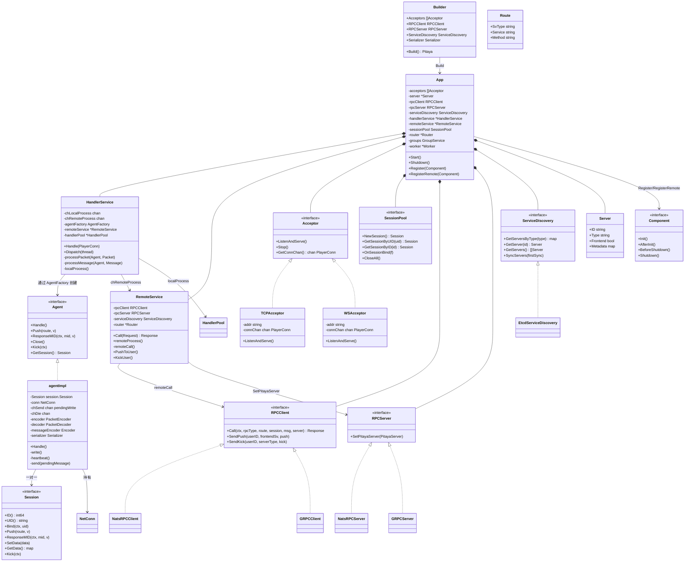
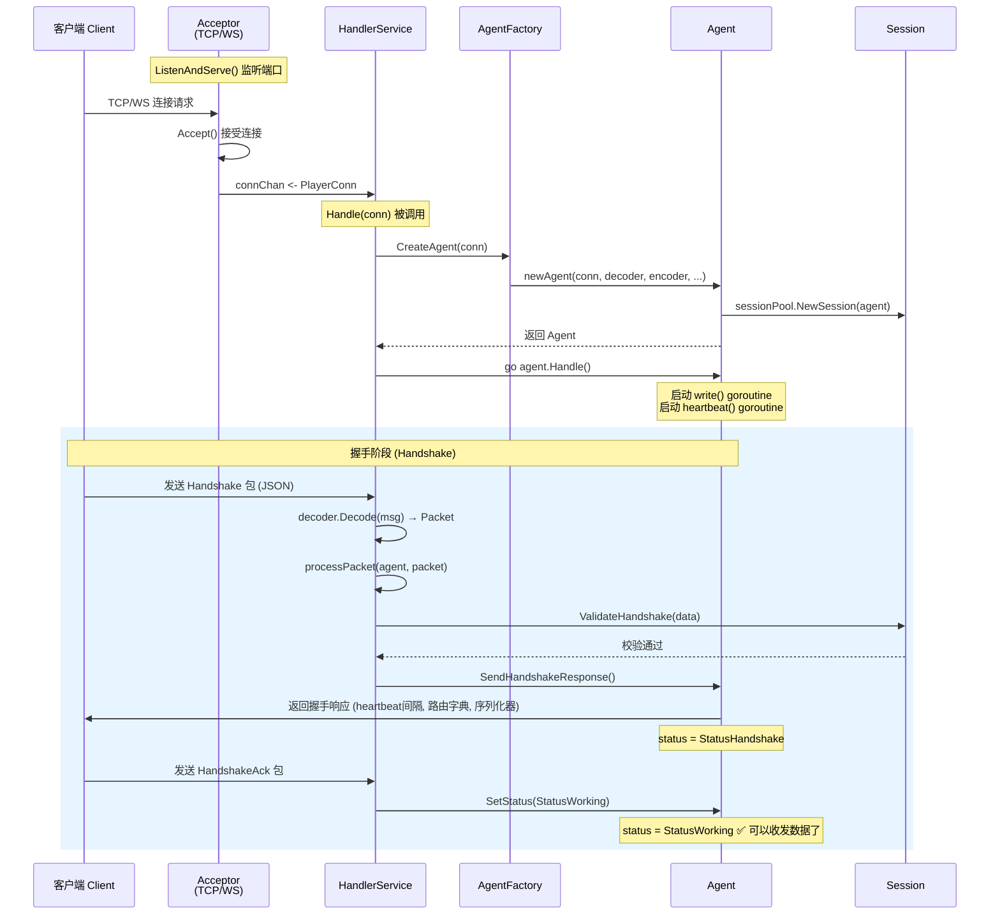
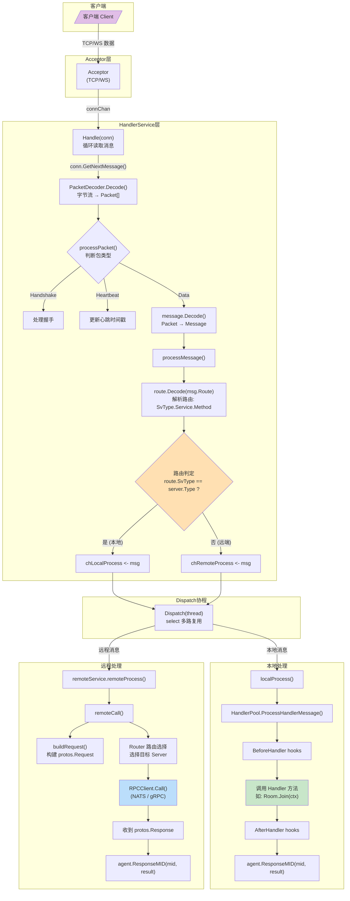
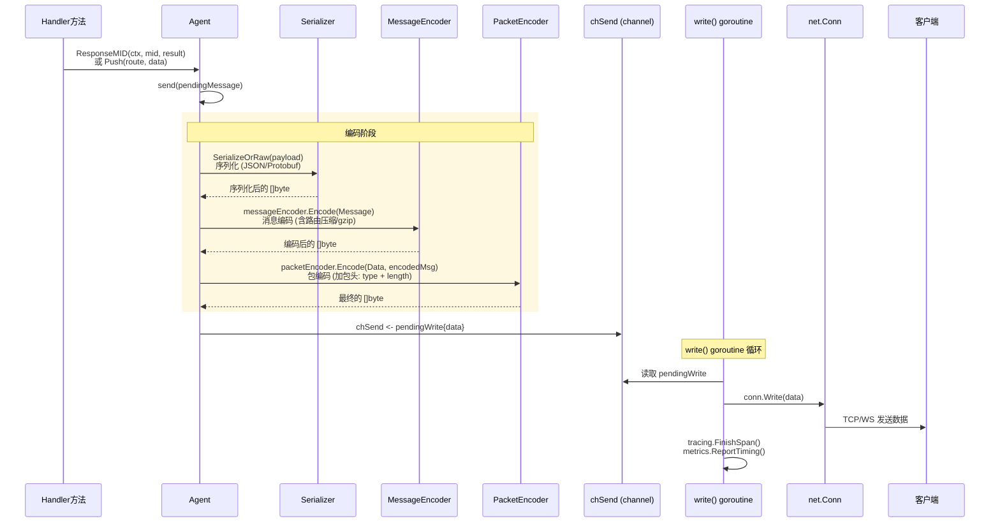
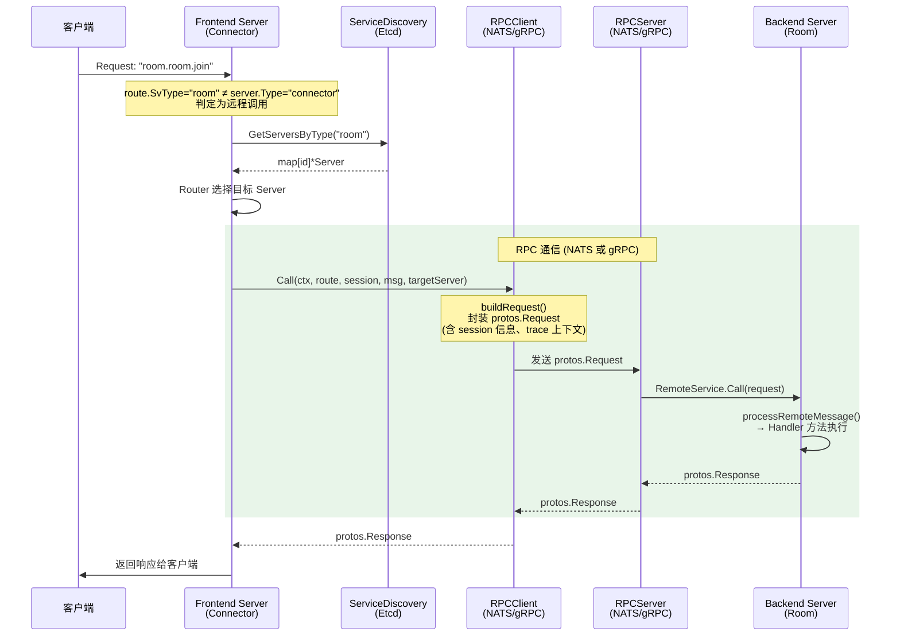
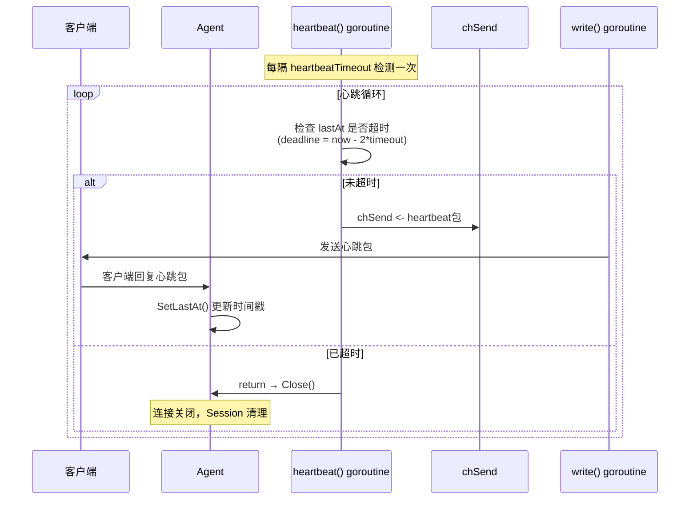
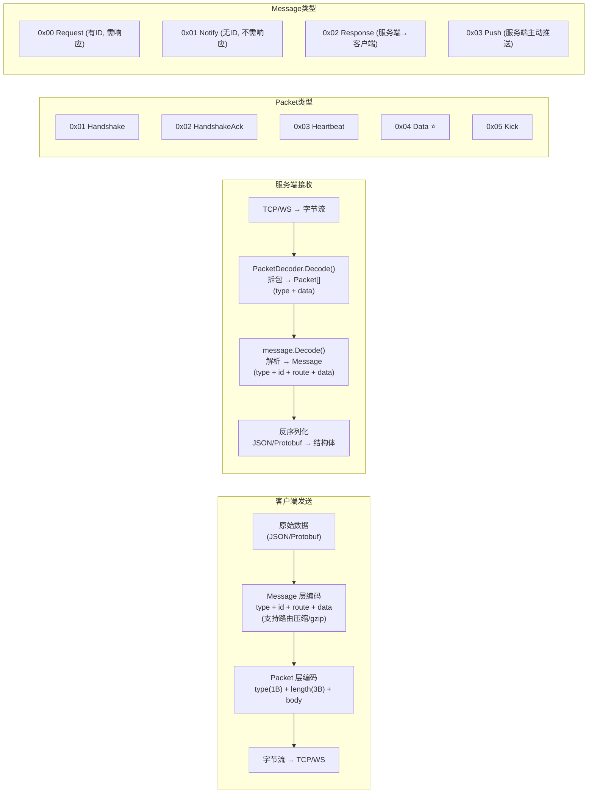
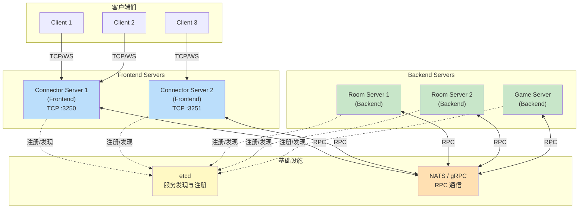

# Pitaya 架构流程图

## 一、整体架构类图（核心组件关系）

```mermaid
classDiagram
    class App {
        -acceptors []Acceptor
        -server *Server
        -rpcClient RPCClient
        -rpcServer RPCServer
        -serviceDiscovery ServiceDiscovery
        -handlerService *HandlerService
        -remoteService *RemoteService
        -sessionPool SessionPool
        -router *Router
        -groups GroupService
        -worker *Worker
        +Start()
        +Shutdown()
        +Register(Component)
        +RegisterRemote(Component)
    }

    class Builder {
        +Acceptors []Acceptor
        +RPCClient RPCClient
        +RPCServer RPCServer
        +ServiceDiscovery ServiceDiscovery
        +Serializer Serializer
        +Build() Pitaya
    }

    class HandlerService {
        -chLocalProcess chan
        -chRemoteProcess chan
        -agentFactory AgentFactory
        -remoteService *RemoteService
        -handlerPool *HandlerPool
        +Handle(PlayerConn)
        +Dispatch(thread)
        -processPacket(Agent, Packet)
        -processMessage(Agent, Message)
        -localProcess()
    }

    class RemoteService {
        -rpcClient RPCClient
        -rpcServer RPCServer
        -serviceDiscovery ServiceDiscovery
        -router *Router
        +Call(Request) Response
        +remoteProcess()
        -remoteCall()
        +PushToUser()
        +KickUser()
    }

    class Agent {
        <<interface>>
        +Handle()
        +Push(route, v)
        +ResponseMID(ctx, mid, v)
        +Close()
        +Kick(ctx)
        +GetSession() Session
    }

    class agentImpl {
        -Session session.Session
        -conn NetConn
        -chSend chan pendingWrite
        -chDie chan
        -encoder PacketEncoder
        -decoder PacketDecoder
        -messageEncoder Encoder
        -serializer Serializer
        +Handle()
        -write()
        -heartbeat()
        -send(pendingMessage)
    }

    class Acceptor {
        <<interface>>
        +ListenAndServe()
        +Stop()
        +GetConnChan() chan PlayerConn
    }

    class TCPAcceptor {
        -addr string
        -connChan chan PlayerConn
        +ListenAndServe()
    }

    class WSAcceptor {
        -addr string
        -connChan chan PlayerConn
        +ListenAndServe()
    }

    class Session {
        <<interface>>
        +ID() int64
        +UID() string
        +Bind(ctx, uid)
        +Push(route, v)
        +ResponseMID(ctx, mid, v)
        +SetData(data)
        +GetData() map
        +Kick(ctx)
    }

    class SessionPool {
        <<interface>>
        +NewSession() Session
        +GetSessionByUID(uid) Session
        +GetSessionByID(id) Session
        +OnSessionBind(f)
        +CloseAll()
    }

    class RPCClient {
        <<interface>>
        +Call(ctx, rpcType, route, session, msg, server) Response
        +SendPush(userID, frontendSv, push)
        +SendKick(userID, serverType, kick)
    }

    class RPCServer {
        <<interface>>
        +SetPitayaServer(PitayaServer)
    }

    class NatsRPCClient
    class NatsRPCServer
    class GRPCClient
    class GRPCServer

    class ServiceDiscovery {
        <<interface>>
        +GetServersByType(type) map
        +GetServer(id) Server
        +GetServers() []Server
        +SyncServers(firstSync)
    }

    class EtcdServiceDiscovery

    class Server {
        +ID string
        +Type string
        +Frontend bool
        +Metadata map
    }

    class Route {
        +SvType string
        +Service string
        +Method string
    }

    class Component {
        <<interface>>
        +Init()
        +AfterInit()
        +BeforeShutdown()
        +Shutdown()
    }

    Builder --> App : Build
    App *-- HandlerService
    App *-- RemoteService
    App *-- Acceptor
    App *-- SessionPool
    App *-- RPCClient
    App *-- RPCServer
    App *-- ServiceDiscovery
    App *-- Server

    HandlerService --> Agent : 通过 AgentFactory 创建
    HandlerService --> RemoteService : chRemoteProcess
    HandlerService --> HandlerPool : localProcess

    RemoteService --> RPCClient : remoteCall
    RemoteService --> RPCServer : SetPitayaServer

    Agent <|.. agentImpl
    agentImpl --> Session : 一对一
    agentImpl --> NetConn : 持有

    Acceptor <|.. TCPAcceptor
    Acceptor <|.. WSAcceptor

    RPCClient <|.. NatsRPCClient
    RPCClient <|.. GRPCClient
    RPCServer <|.. NatsRPCServer
    RPCServer <|.. GRPCServer
    ServiceDiscovery <|.. EtcdServiceDiscovery

    App --> Component : Register/RegisterRemote
```

## 二、连接建立与握手流程

```mermaid
sequenceDiagram
    participant C as 客户端 Client
    participant ACC as Acceptor<br/>(TCP/WS)
    participant HS as HandlerService
    participant AF as AgentFactory
    participant A as Agent
    participant S as Session

    Note over ACC: ListenAndServe() 监听端口
    C->>ACC: TCP/WS 连接请求
    ACC->>ACC: Accept() 接受连接
    ACC->>HS: connChan <- PlayerConn

    Note over HS: Handle(conn) 被调用
    HS->>AF: CreateAgent(conn)
    AF->>A: newAgent(conn, decoder, encoder, ...)
    A->>S: sessionPool.NewSession(agent)
    A-->>HS: 返回 Agent

    HS->>A: go agent.Handle()
    Note over A: 启动 write() goroutine<br/>启动 heartbeat() goroutine

    rect rgb(230, 245, 255)
        Note over C,A: 握手阶段 (Handshake)
        C->>HS: 发送 Handshake 包 (JSON)
        HS->>HS: decoder.Decode(msg) → Packet
        HS->>HS: processPacket(agent, packet)
        HS->>S: ValidateHandshake(data)
        S-->>HS: 校验通过
        HS->>A: SendHandshakeResponse()
        A->>C: 返回握手响应 (heartbeat间隔, 路由字典, 序列化器)
        Note over A: status = StatusHandshake

        C->>HS: 发送 HandshakeAck 包
        HS->>A: SetStatus(StatusWorking)
        Note over A: status = StatusWorking ✅ 可以收发数据了
    end
```

## 三、客户端请求处理（收包）完整流程

```mermaid
flowchart TB
    subgraph 客户端
        Client[/"客户端 Client"/]
    end

    subgraph Acceptor层
        ACC["Acceptor<br/>(TCP/WS)"]
    end

    subgraph HandlerService层
        HANDLE["Handle(conn)<br/>循环读取消息"]
        DECODE_PKT["PacketDecoder.Decode()<br/>字节流 → Packet[]"]
        PROCESS_PKT{"processPacket()<br/>判断包类型"}
        HANDSHAKE["处理握手"]
        HEARTBEAT["更新心跳时间戳"]
        DECODE_MSG["message.Decode()<br/>Packet → Message"]
        PROCESS_MSG["processMessage()"]
        ROUTE_DECODE["route.Decode(msg.Route)<br/>解析路由: SvType.Service.Method"]
        ROUTE_CHECK{"路由判定<br/>route.SvType == server.Type ?"}
        CH_LOCAL["chLocalProcess <- msg"]
        CH_REMOTE["chRemoteProcess <- msg"]
    end

    subgraph Dispatch协程
        DISPATCH["Dispatch(thread)<br/>select 多路复用"]
    end

    subgraph 本地处理
        LOCAL["localProcess()"]
        HANDLER_POOL["HandlerPool.ProcessHandlerMessage()"]
        HOOKS_BEFORE["BeforeHandler hooks"]
        HANDLER_METHOD["调用 Handler 方法<br/>如: Room.Join(ctx)"]
        HOOKS_AFTER["AfterHandler hooks"]
        RESPONSE_LOCAL["agent.ResponseMID(mid, result)"]
    end

    subgraph 远程处理
        REMOTE_PROC["remoteService.remoteProcess()"]
        REMOTE_CALL["remoteCall()"]
        BUILD_REQ["buildRequest()<br/>构建 protos.Request"]
        ROUTER["Router 路由选择<br/>选择目标 Server"]
        RPC_CALL["RPCClient.Call()<br/>(NATS / gRPC)"]
        REMOTE_RESP["收到 protos.Response"]
        RESPONSE_REMOTE["agent.ResponseMID(mid, result)"]
    end

    Client -->|"TCP/WS 数据"| ACC
    ACC -->|"connChan"| HANDLE
    HANDLE -->|"conn.GetNextMessage()"| DECODE_PKT
    DECODE_PKT --> PROCESS_PKT

    PROCESS_PKT -->|"Handshake"| HANDSHAKE
    PROCESS_PKT -->|"Heartbeat"| HEARTBEAT
    PROCESS_PKT -->|"Data"| DECODE_MSG

    DECODE_MSG --> PROCESS_MSG
    PROCESS_MSG --> ROUTE_DECODE
    ROUTE_DECODE --> ROUTE_CHECK

    ROUTE_CHECK -->|"是 (本地)"| CH_LOCAL
    ROUTE_CHECK -->|"否 (远端)"| CH_REMOTE

    CH_LOCAL --> DISPATCH
    CH_REMOTE --> DISPATCH

    DISPATCH -->|"本地消息"| LOCAL
    DISPATCH -->|"远程消息"| REMOTE_PROC

    LOCAL --> HANDLER_POOL
    HANDLER_POOL --> HOOKS_BEFORE
    HOOKS_BEFORE --> HANDLER_METHOD
    HANDLER_METHOD --> HOOKS_AFTER
    HOOKS_AFTER --> RESPONSE_LOCAL

    REMOTE_PROC --> REMOTE_CALL
    REMOTE_CALL --> BUILD_REQ
    REMOTE_CALL --> ROUTER
    ROUTER --> RPC_CALL
    RPC_CALL --> REMOTE_RESP
    REMOTE_RESP --> RESPONSE_REMOTE

    style ROUTE_CHECK fill:#FFE0B2
    style HANDLER_METHOD fill:#C8E6C9
    style RPC_CALL fill:#BBDEFB
    style Client fill:#E1BEE7
```

## 四、响应发送（发包）流程

```mermaid
sequenceDiagram
    participant H as Handler方法
    participant A as Agent
    participant SE as Serializer
    participant ME as MessageEncoder
    participant PE as PacketEncoder
    participant CH as chSend (channel)
    participant W as write() goroutine
    participant CONN as net.Conn
    participant C as 客户端

    H->>A: ResponseMID(ctx, mid, result)<br/>或 Push(route, data)
    A->>A: send(pendingMessage)

    rect rgb(255, 248, 225)
        Note over A,PE: 编码阶段
        A->>SE: SerializeOrRaw(payload)<br/>序列化 (JSON/Protobuf)
        SE-->>A: 序列化后的 []byte

        A->>ME: messageEncoder.Encode(Message)<br/>消息编码 (含路由压缩/gzip)
        ME-->>A: 编码后的 []byte

        A->>PE: packetEncoder.Encode(Data, encodedMsg)<br/>包编码 (加包头: type + length)
        PE-->>A: 最终的 []byte
    end

    A->>CH: chSend <- pendingWrite{data}

    Note over W: write() goroutine 循环
    W->>CH: 读取 pendingWrite
    W->>CONN: conn.Write(data)
    CONN->>C: TCP/WS 发送数据
    W->>W: tracing.FinishSpan()<br/>metrics.ReportTiming()
```

## 五、集群 RPC 调用流程

```mermaid
sequenceDiagram
    participant C as 客户端
    participant FE as Frontend Server<br/>(Connector)
    participant SD as ServiceDiscovery<br/>(Etcd)
    participant RPC_C as RPCClient<br/>(NATS/gRPC)
    participant RPC_S as RPCServer<br/>(NATS/gRPC)
    participant BE as Backend Server<br/>(Room)

    C->>FE: Request: "room.room.join"

    Note over FE: route.SvType="room" ≠ server.Type="connector"<br/>判定为远程调用

    FE->>SD: GetServersByType("room")
    SD-->>FE: map[id]*Server

    FE->>FE: Router 选择目标 Server

    rect rgb(232, 245, 233)
        Note over RPC_C,RPC_S: RPC 通信 (NATS 或 gRPC)
        FE->>RPC_C: Call(ctx, route, session, msg, targetServer)

        Note over RPC_C: buildRequest()<br/>封装 protos.Request<br/>(含 session 信息、trace 上下文)
        RPC_C->>RPC_S: 发送 protos.Request

        RPC_S->>BE: RemoteService.Call(request)
        BE->>BE: processRemoteMessage()<br/>→ Handler 方法执行
        BE-->>RPC_S: protos.Response

        RPC_S-->>RPC_C: protos.Response
    end

    RPC_C-->>FE: protos.Response
    FE->>C: 返回响应给客户端
```

## 六、心跳机制

```mermaid
sequenceDiagram
    participant C as 客户端
    participant A as Agent
    participant HB as heartbeat() goroutine
    participant CH as chSend
    participant W as write() goroutine

    Note over HB: 每隔 heartbeatTimeout 检测一次

    loop 心跳循环
        HB->>HB: 检查 lastAt 是否超时<br/>(deadline = now - 2*timeout)

        alt 未超时
            HB->>CH: chSend <- heartbeat包
            W->>C: 发送心跳包
            C->>A: 客户端回复心跳包
            A->>A: SetLastAt() 更新时间戳
        else 已超时
            HB->>A: return → Close()
            Note over A: 连接关闭，Session 清理
        end
    end
```

## 七、App 启动流程

```mermaid
flowchart TB
    START["Builder.Build()"] --> CREATE_APP["NewApp() 创建应用实例"]
    CREATE_APP --> INIT_SYS["initSysRemotes() 注册系统远程服务"]

    INIT_SYS --> APP_START["app.Start()"]

    APP_START --> CHECK_MODE{"serverMode?"}

    CHECK_MODE -->|"Cluster"| REG_RPC["注册 rpcServer, rpcClient 模块"]
    REG_RPC --> REG_SD["注册 serviceDiscovery 模块"]
    REG_SD --> METRICS["periodicMetrics() 启动指标上报"]

    CHECK_MODE -->|"Standalone"| METRICS

    METRICS --> LISTEN["app.listen()"]

    LISTEN --> STARTUP_COMP["startupComponents()<br/>初始化所有注册的 Handler/Remote"]
    STARTUP_COMP --> GLOBAL_TICKER["创建全局 Timer Ticker"]
    GLOBAL_TICKER --> DISPATCH["启动 N 个 Dispatch goroutine"]

    DISPATCH --> ACC_LOOP["遍历所有 Acceptor"]
    ACC_LOOP --> ACC_LISTEN["每个 Acceptor: go ListenAndServe()"]
    ACC_LISTEN --> ACC_HANDLE["启动连接处理: for conn := range connChan"]
    ACC_HANDLE --> HANDLER_SVC["go handlerService.Handle(conn)"]

    HANDLER_SVC --> UNIQUE_SESSION{"Frontend + Cluster?"}
    UNIQUE_SESSION -->|"是"| REG_UNIQUE["注册 UniqueSession 模块"]
    UNIQUE_SESSION -->|"否"| START_MODULES

    REG_UNIQUE --> START_MODULES["startModules() 启动所有模块"]
    START_MODULES --> RUNNING["app.running = true ✅"]

    RUNNING --> WAIT{"等待信号"}
    WAIT -->|"SIGTERM + Drain"| DRAIN["Session Drain<br/>等待所有会话结束"]
    WAIT -->|"SIGINT/SIGQUIT/dieChan"| SHUTDOWN

    DRAIN --> SHUTDOWN["Shutdown<br/>关闭 Sessions → 关闭 Modules → 关闭 Components"]

    style START fill:#E8EAF6
    style RUNNING fill:#C8E6C9
    style SHUTDOWN fill:#FFCDD2
```

## 八、数据编解码分层

```mermaid
flowchart LR
    subgraph 客户端发送
        RAW["原始数据<br/>(JSON/Protobuf)"]
        MSG_E["Message 层编码<br/>type + id + route + data<br/>(支持路由压缩/gzip)"]
        PKT_E["Packet 层编码<br/>type(1B) + length(3B) + body"]
        BYTES_OUT["字节流 → TCP/WS"]
    end

    RAW --> MSG_E --> PKT_E --> BYTES_OUT

    subgraph 服务端接收
        BYTES_IN["TCP/WS → 字节流"]
        PKT_D["PacketDecoder.Decode()<br/>拆包 → Packet[]<br/>(type + data)"]
        MSG_D["message.Decode()<br/>解析 → Message<br/>(type + id + route + data)"]
        DESER["反序列化<br/>JSON/Protobuf → 结构体"]
    end

    BYTES_IN --> PKT_D --> MSG_D --> DESER

    subgraph Packet类型
        P1["0x01 Handshake"]
        P2["0x02 HandshakeAck"]
        P3["0x03 Heartbeat"]
        P4["0x04 Data ⭐"]
        P5["0x05 Kick"]
    end

    subgraph Message类型
        M1["0x00 Request (有ID, 需响应)"]
        M2["0x01 Notify (无ID, 不需响应)"]
        M3["0x02 Response (服务端→客户端)"]
        M4["0x03 Push (服务端主动推送)"]
    end
```

## 九、Frontend / Backend 集群拓扑

```mermaid
flowchart TB
    subgraph 客户端们
        C1["Client 1"]
        C2["Client 2"]
        C3["Client 3"]
    end

    subgraph Frontend Servers
        F1["Connector Server 1<br/>(Frontend)<br/>TCP :3250"]
        F2["Connector Server 2<br/>(Frontend)<br/>TCP :3251"]
    end

    subgraph Backend Servers
        B1["Room Server 1<br/>(Backend)"]
        B2["Room Server 2<br/>(Backend)"]
        B3["Game Server<br/>(Backend)"]
    end

    subgraph 基础设施
        ETCD["etcd<br/>服务发现与注册"]
        NATS["NATS / gRPC<br/>RPC 通信"]
    end

    C1 -->|"TCP/WS"| F1
    C2 -->|"TCP/WS"| F1
    C3 -->|"TCP/WS"| F2

    F1 <-->|"RPC"| NATS
    F2 <-->|"RPC"| NATS
    B1 <-->|"RPC"| NATS
    B2 <-->|"RPC"| NATS
    B3 <-->|"RPC"| NATS

    F1 -.->|"注册/发现"| ETCD
    F2 -.->|"注册/发现"| ETCD
    B1 -.->|"注册/发现"| ETCD
    B2 -.->|"注册/发现"| ETCD
    B3 -.->|"注册/发现"| ETCD

    style F1 fill:#BBDEFB
    style F2 fill:#BBDEFB
    style B1 fill:#C8E6C9
    style B2 fill:#C8E6C9
    style B3 fill:#C8E6C9
    style ETCD fill:#FFF9C4
    style NATS fill:#FFE0B2
```
