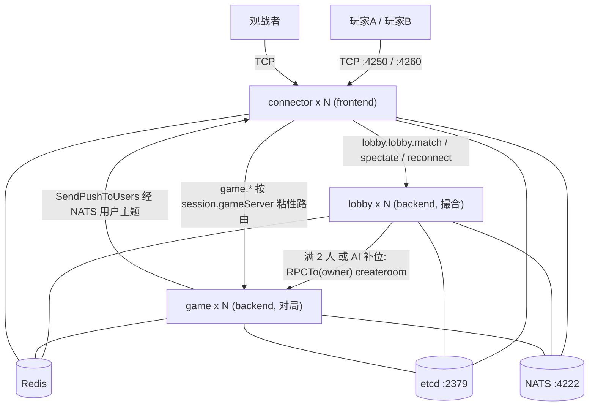
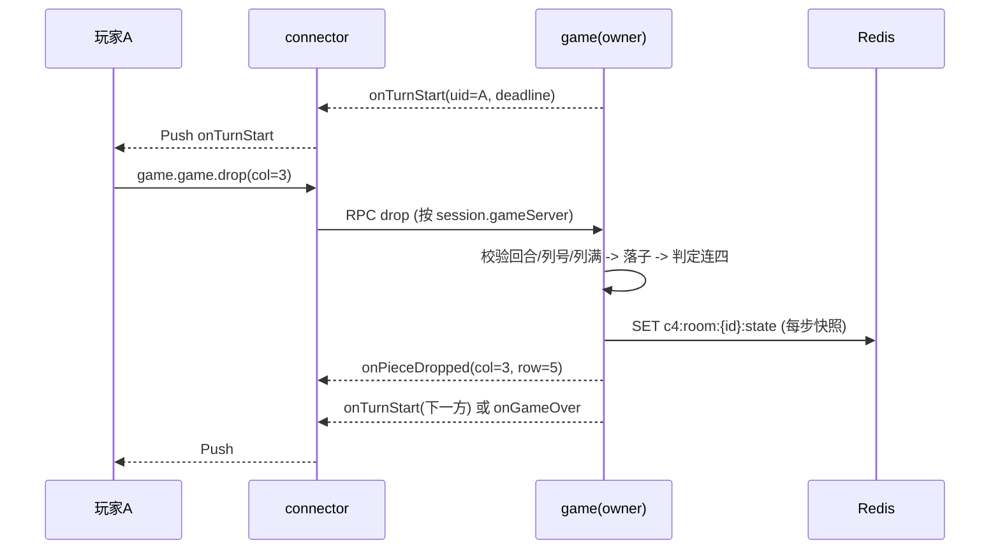

# 四子棋 Connect 4 - 需求 / 协议 / 架构设计

> 基于 **Pitaya v2**（`github.com/topfreegames/pitaya/v2`）集群模式实现的 2 人四子棋对战游戏。
> connector(接入) / lobby(匹配) / game(对局) 三类节点分离，全链路 protobuf 序列化，etcd + NATS + Redis。
>
> **模块说明**：本示例位于 pitaya v3 仓库目录树内，但是一个**独立 Go 模块**（`module connect4`，见本目录 `go.mod`），依赖 `pitaya/v2`。因 v2 要求 `go >= 1.25` 而外层仓库 `go.work` 固定较低工具链，构建/运行本示例时须在本目录内并设置 `GOWORK=off`。

---

## 1. 产品概述

### 1.1 一句话描述
两名玩家轮流在 7 列 x 6 行的竖直棋盘上投子，棋子受重力落到所选列的最低空位，先在横、竖、斜任一方向连成 4 子者获胜。

### 1.2 目标与范围（MVP）
- 验证 Pitaya 集群下「前后端分离 + protobuf 协议 + 2 人房间对战」的完整闭环。
- 强规则约束的回合制对局：服务端权威判定，客户端只提交列号。
- 覆盖 7 个可自动化验收的场景：双人对局、AI 补位、断线重连、观战、owner 宕机恢复、取消匹配、超时判负。

### 1.3 非目标（本期不做）
认输 / 求和 / 悔棋、ELO 与排行榜、棋谱归档与回放接口、多棋盘尺寸切换、好友房与邀请码、匹配分段。

---

## 2. 核心玩法规则

### 2.1 棋盘与座位
| 项 | 值 |
| --- | --- |
| 棋盘 | 7 列 x 6 行（`Cols=7 / Rows=6`，常量可改） |
| 获胜条件 | 任一方向连成 4 子（`WinLen=4`） |
| 人数 | 固定 2 人 |
| 座位 0 | 红子（`PIECE_RED`） |
| 座位 1 | 黄子（`PIECE_YELLOW`） |
| 先手 | 建房时随机（`CreateRoomRequest.first_seat`），开局推送中告知 |

坐标约定：`col ∈ [0,6]` 自左向右，`row ∈ [0,5]` 自下向上，`row=0` 为最底行。棋盘编码为长度 42 的字节数组，`index = row*Cols + col`，取值即 `Piece` 枚举值。

### 2.2 落子
- 客户端只发列号 `col`，落点行号由服务端按该列当前高度计算，客户端无权指定。
- 服务端校验三件事并分别返回错误码：是否轮到你（`RESULT_BAD_TURN`）、列号是否合法（`RESULT_BAD_COL`）、该列是否已满（`RESULT_COL_FULL`）。
- 胜负判定只检查**最后落子点**的四个方向（水平、垂直、右上斜、左上斜），复杂度 O(WinLen×4)，不做全盘扫描；判定命中时连同获胜连线（`winning_line`）一起下发，客户端可直接高亮。

### 2.3 结束条件
| 原因 | 枚举 | 说明 |
| --- | --- | --- |
| 连成四子 | `END_CONNECT4` | 落子方获胜 |
| 满盘 | `END_DRAW_FULL` | 42 子下满且无连四，平局（`winner_seat = -1`） |
| 超时超限 | `END_TIMEOUT` | 同一玩家累计超时 3 次，判负 |
| 掉线超时 | `END_DISCONNECT` | 掉线超过 60 秒宽限期，判负 |

### 2.4 超时与掉线（两条规则互补，不冲突）
- **单步思考时限 15 秒**（`TurnTimeout`）。超时不直接判负，而是由服务端 AI 以浅搜索（深度 2）代落一子，并把该玩家 `timeout_count++`；累计 3 次（`MaxTimeouts`）判负。落子推送带 `by_timeout=true`，客户端可区分展示。
- **掉线不立即判负**：connector 侧会话关闭时通过内部 RPC 通报 owner，owner 开启 60 秒宽限（`OfflineGrace`）并给对手推送 `onOpponentOffline`；宽限内重连成功则取消计时并推送 `onOpponentOnline`，否则判负。
- 二者叠加的效果：网络抖动不会立刻输棋（对局靠超时代打继续推进），而彻底掉线约 45~60 秒内必然收敛出结果。

### 2.5 AI
- **补位**：玩家进入匹配队列后 10 秒（`AIFillWait`）仍无真人对手，则由 AI 补上空位开局，玩家收到 `onMatchUpdate(MATCH_AI_FILLED)`，`PlayerInfo.is_ai=true`。
- **算法**：negamax + alpha-beta 剪枝，列序中心优先 `[3,2,4,1,5,0,6]`，正常出手深度 6（`AIDepth`）、超时代打深度 2（`AIFastDepth`）。达到深度上限时用"未被对手封死的 4 连窗口"启发式评分（1/2/3 子分别记 1/12/60 分，中心列额外加权），终局直接返回终局分并按剩余深度偏好更快取胜。同分列之间随机取一个（蓄水池抽样），避免每局棋路完全相同。
- 单元测试覆盖了"有必胜点必取、有必败点必堵、取胜优先于封堵、返回值一定合法"四项战术正确性。

### 2.6 观战
- 观战者不占座位、不能落子，通过 `lobby.lobby.roomlist` 拿到可观战房间，`lobby.lobby.spectate` 绑定路由，`game.game.watch` 注册并取回全量棋盘。
- 注册后与玩家收到完全相同的对局推送；观战人数变化广播 `onSpectatorUpdate`。
- 观战者会话断开时由 connector 通报 owner，从观战列表中移除。

---

## 3. 系统架构

多节点集群：`connector`(N，接入) + `lobby`(N，匹配) + `game`(N，对局)。房间在**建房时**用 rendezvous 哈希选定 owner game 节点，owner 写入 session 与 Redis 目录；此后 `game.*` 请求一律按 `session.gameServer` 粘性路由，不再现算哈希，避免多 connector 视图不一致。



- **connector（frontend, N 台）**：TCP 接入；`connector.login` 登录并 `s.Bind(uid)`（支持 `last_uid` 身份续接）；`AddRoute("game")` 装配粘性路由；会话关闭时向 owner 通报掉线。
- **lobby（backend, N 台）**：Redis 共享队列撮合（Lua 原子）、分配 `roomId`+座位、`routing.OwnerServerID` 选 owner、写 session 后 `PushToFront`、满员 RPC 建房；另外承载 AI 补位、断线重连定位、观战定位、owner 重指派恢复。启用 Redis 时无本地状态，可水平扩容。
- **game（backend, N 台）**：只持有本节点作为 owner 的房间（内存 `RoomManager`）、棋局状态机、AI、回合与掉线定时器、全部对局推送；**每步落子后**写一次 Redis 快照。
- **序列化**：三类节点均 `builder.Serializer = protobuf.NewSerializer()`，所有 handler 参数/返回值都是 `proto.Message`（含 login）。
- **集群**：服务发现 etcd，RPC 传输 NATS（默认 Builder 自动装配）；uid→connector 的推送靠 NATS 用户主题，无需 BindingStorage、也未使用 Group 广播。

### 3.1 抗宕机（每步快照 + 惰性恢复）
1. game 节点在每步落子后异步写 `GameSnapshot` 到 Redis（整局状态 42 字节棋盘 + 少量元信息，成本可忽略，RPO ≈ 一步以内）；优雅关机时 `app.Start()` 返回后再 flush 一次全部房间。
2. connector 路由发现 `session.gameServer` 不在存活节点列表中 → RPC `lobby.lobbyremote.resolveowner`。
3. lobby 读 owner 目录：owner 仍存活则直接返回（只是 connector 视图陈旧）；否则 `SETNX` 抢恢复锁 → rendezvous 在存活节点中重选 newOwner → `RPCTo(newOwner, game.gameremote.restoreroom)` 从快照 `RestoreRoom` 并 `Resume` 续跑 → 更新目录。
4. connector 改写本地 `session.gameServer` 并把请求路由到新 owner；新 owner 先向房间内所有人重推 `onGameStart(resync=true)` 做全量重同步，再续跑当前回合。
5. 客户端周期性 `game.game.getgamestate` 心跳（示例为 3 秒）是驱动上述惰性恢复的关键：双方都在等推送时，需要有请求来触发重指派。

---

## 4. 通信协议

协议定义见 [protos/connect4.proto](protos/connect4.proto)。路由约定 `{svType}.{component}.{method}`，方法名小写。proto 中的 `service` 仅作接口契约文档（Pitaya 的 handler 路由在 Go 代码里注册，生成时不产生 gRPC 桩）。

**前置约定**：`game.*` 按 `session.gameServer` 粘性路由，客户端必须先完成 `lobby.lobby.match` / `spectate` / `reconnect` 之一，session 才有 gameServer；否则路由会被拒绝。

### 4.1 请求（client → server）
| 路由 | 请求 | 响应 | 说明 |
| --- | --- | --- | --- |
| `connector.login` | `LoginRequest{player_name, last_uid}` | `LoginResponse{code,uid,name,resumed}` | 登录并绑定会话；`last_uid` 有效时复用同一 uid |
| `lobby.lobby.match` | `MatchRequest{}` | `MatchResponse{code,room_id,seat,matched,with_ai}` | 请求匹配；`matched=false` 表示在队列中等待 |
| `lobby.lobby.cancelmatch` | `CancelMatchRequest{}` | `AckResponse` | 取消匹配（已开局则失败） |
| `lobby.lobby.reconnect` | `ReconnectRequest{}` | `ReconnectResponse{code,room_id,seat,role}` | 按 uid 反查在局房间并重建粘性路由 |
| `lobby.lobby.roomlist` | `RoomListRequest{limit}` | `RoomListResponse{rooms[]}` | 可观战房间列表 |
| `lobby.lobby.spectate` | `SpectateRequest{room_id}` | `AckResponse` | 选择观战房间（写入 session） |
| `game.game.drop` | `DropRequest{col}` | `AckResponse` | 落子 |
| `game.game.watch` | `WatchRequest{}` | `GameStateResponse` | 注册观战并取回全量状态 |
| `game.game.getgamestate` | `GameStateRequest{}` | `GameStateResponse` | 全量状态同步（重连 / 心跳 / 驱动恢复） |

### 4.2 推送（server → client）
| 路由 | 消息 | 触发时机 |
| --- | --- | --- |
| `onMatchUpdate` | `MatchUpdatePush{state,waiting_seconds,msg}` | 进入队列 / AI 补位 |
| `onGameStart` | `GameStartPush{cols,rows,win_len,players[],first_seat,turn_timeout_sec,board,current_seat,move_no,resync}` | 开局，或故障恢复后的全量重同步（`resync=true`） |
| `onTurnStart` | `TurnStartPush{uid,seat,move_no,deadline_unix_ms}` | 轮到某方行动，带本回合截止时间 |
| `onPieceDropped` | `PieceDroppedPush{uid,seat,col,row,piece,move_no,by_timeout}` | 落子成功 |
| `onGameOver` | `GameOverPush{winner_uid,winner_seat,winner_name,reason,winning_line[],board}` | 对局结束 |
| `onOpponentOffline` | `OpponentStatusPush{uid,seat,online,grace_seconds}` | 对手掉线，带宽限秒数 |
| `onOpponentOnline` | `OpponentStatusPush{uid,seat,online}` | 对手重连回来 |
| `onSpectatorUpdate` | `SpectatorUpdatePush{room_id,count}` | 观战人数变化 |
| `onError` | `ErrorPush{code,msg}` | 错误提示 |

### 4.3 内部 RPC（非客户端可见）
| 路由 | 请求 | 说明 |
| --- | --- | --- |
| `game.gameremote.createroom` | `CreateRoomRequest{room_id,members[],with_ai,first_seat}` | lobby 撮合完成后请求 owner 建房开局 |
| `game.gameremote.restoreroom` | `RestoreRoomRequest{room_id}` | lobby 请求新 owner 从快照恢复房间 |
| `game.gameremote.playerconn` | `PlayerConnRequest{room_id,uid,online}` → `PlayerConnResponse{seat,role}` | connector/lobby 通报掉线与重连 |
| `lobby.lobbyremote.resolveowner` | `ResolveOwnerRequest{room_id}` → `ResolveOwnerResponse{owner}` | connector 在 owner 失联时请求重指派 |

### 4.4 枚举
```proto
enum ResultCode { RESULT_OK=0; RESULT_ERROR=1; RESULT_NOT_LOGIN=2; RESULT_NOT_IN_ROOM=3;
                  RESULT_BAD_TURN=4; RESULT_ROOM_NOT_FOUND=5; RESULT_COL_FULL=6; RESULT_BAD_COL=7; }
enum RoomState  { ROOM_WAITING=0; ROOM_PLAYING=1; ROOM_OVER=2; }
enum Piece      { PIECE_EMPTY=0; PIECE_RED=1; PIECE_YELLOW=2; }
enum PlayerRole { ROLE_PLAYER=0; ROLE_SPECTATOR=1; }
enum EndReason  { END_UNKNOWN=0; END_CONNECT4=1; END_DRAW_FULL=2; END_TIMEOUT=3; END_DISCONNECT=4; }
enum MatchState { MATCH_QUEUING=0; MATCH_MATCHED=1; MATCH_AI_FILLED=2; }
```

### 4.5 关键时序（一次落子）



---

## 5. Redis 键空间设计

Redis 在本示例中承担三类职责：**撮合仲裁**、**房间目录与状态快照**、**在线态反查索引**。所有键都带 TTL，对局结束即清理（见 [store/redis.go](store/redis.go)）。

| 键 | 类型 | 内容 | TTL | 用途 |
| --- | --- | --- | --- | --- |
| `c4:uid:{uid}` | Hash | `{name}` | 1h | 身份档案，支撑 `last_uid` 登录续接 |
| `c4:mm:open` | String | `roomId` | 30m | 当前开放中的匹配房间，撮合的唯一仲裁点 |
| `c4:mm:room:{roomId}:members` | List | `uid<0x1f>name` | 30m | 候选花名册，入队顺序即座位号 |
| `c4:mm:room:{roomId}:owner` | String | `serverId` | 30m | 候选 owner，建房时固化 |
| `c4:room:{roomId}:owner` | String | `serverId` | 30m | 房间 owner 目录，恢复与重连定位 |
| `c4:room:{roomId}:state` | Bytes | `GameSnapshot`(protobuf) | 30m | 每步落子后写入的状态快照 |
| `c4:room:{roomId}:lock` | String | 持有者 | 10s | 恢复锁（`SETNX`），防并发双恢复 |
| `c4:player:{uid}:room` | String | `roomId` | 30m | 按玩家反查在局房间，断线重连用 |
| `c4:rooms:live` | ZSET | `roomId -> startedAt` | 随房间清理 | 可观战房间列表（按开局时间倒序） |

三段 Lua 脚本保证撮合过程的原子性：

- **入队撮合**：无开放房则用候选 `roomId/owner` 开房，`RPUSH` 成员并返回座位；满 2 人则删除 `c4:mm:open`（下一次 match 会开新房）。
- **AI 补位 CAS**：仅当 `c4:mm:open == roomId` 且人数仍未满时，删除开放房标记并交由调用方建 AI 房；因此"真人对手刚好赶到"和"等待超时补 AI"这两条路径不会同时成功。
- **取消匹配**：仅当该房仍是开放房时 `LREM` 移除该成员，房间空了顺带清理三个键。

> 权衡说明：AI 补位的 10 秒计时器由处理该次 `match` 请求的 lobby 进程持有。若该 lobby 在等待期内挂掉，计时器随之丢失，玩家重发 `match` 即可重新入队（该房间的匹配键会在 TTL 后自然过期）。
>
> 降级路径：`-redis` 置空或 Ping 失败时，lobby 退化为单实例内存撮合，且不再提供快照恢复、断线重连与观战列表，行为与 richman Phase 1 一致。

### 5.1 房间快照内容
`GameSnapshot` 包含 `room_id / state / cols / rows / cells(42 字节) / current_seat / move_no / first_seat / players[](uid,name,seat,is_ai,timeout_count,online) / winner_* / reason / started_at / moves[](落子列序)`。棋盘用字节数组而非坐标列表，恢复时按重力规则重建列高。`moves` 保留完整棋谱，便于排错（本期不提供回放接口）。

---

## 6. 目录结构

```
examples/demo/connect4/
├── REQUIREMENTS.md          # 本文档
├── docker-compose.yml       # etcd + nats + redis
├── go.mod / go.work         # 独立模块 module connect4 (go 1.25, pitaya/v2)
├── main.go                  # -type(connector/lobby/game) -frontend -port -redis; 粘性路由装配
├── protos/
│   ├── connect4.proto       # 协议定义(枚举/请求/推送/内部 RPC/快照)
│   └── connect4.pb.go       # 生成的 pb 代码
├── routing/
│   └── owner.go             # rendezvous 哈希: roomId -> owner game 节点(仅建房/重指派时选)
├── store/
│   └── redis.go             # 键空间 + 撮合/补位/取消 Lua + 快照 + 恢复锁 + 索引
├── services/
│   ├── connector.go         # 登录(含 last_uid 续接) + 掉线通报
│   ├── lobby.go             # match/cancelmatch/reconnect/roomlist/spectate + resolveowner + AI 补位
│   └── game.go              # drop/watch/getgamestate + createroom/restoreroom/playerconn + 全部推送
├── game/
│   ├── board.go             # 棋盘、落子、连四判定、编解码
│   ├── ai.go                # negamax + alpha-beta + 启发式评分
│   ├── room.go              # 房间状态机: 回合轮转/超时代打/掉线宽限/结算
│   ├── manager.go           # 本节点房间表
│   ├── snapshot.go          # 快照生成与恢复
│   ├── board_test.go        # 棋盘规则单测
│   └── ai_test.go           # AI 战术正确性单测
├── testclient/
│   ├── main.go              # 5 个验收场景入口
│   └── client.go            # 客户端(本地棋盘镜像 + 自动落子 + 重连/观战)
└── localinfra/
    └── main.go              # 无 Docker 时的 etcd + nats + miniredis
```

---

## 7. 运行方式

> 所有命令都需在本目录内执行并带 `GOWORK=off`（脱离外层 workspace，使用本模块自带 go.mod 与工具链）。

```bash
cd examples/demo/connect4
docker compose up -d                                              # etcd + nats + redis
# 无 Docker 时用内置基础设施替代(嵌入式 etcd + nats-server + miniredis)
GOWORK=off go run ./localinfra

# 多节点集群: 1 lobby + 2 game + 2 connector(各自独立终端)
GOWORK=off go run . -type lobby     -frontend=false -port 4252
GOWORK=off go run . -type game      -frontend=false -port 4251
GOWORK=off go run . -type game      -frontend=false -port 4253
GOWORK=off go run . -type connector -frontend=true  -port 4250
GOWORK=off go run . -type connector -frontend=true  -port 4260

# 验收场景
GOWORK=off go run ./testclient -scenario duel        # 双人对局
GOWORK=off go run ./testclient -scenario ai          # AI 补位
GOWORK=off go run ./testclient -scenario reconnect   # 断线重连
GOWORK=off go run ./testclient -scenario spectate    # 观战
GOWORK=off go run ./testclient -scenario failover    # owner 宕机恢复(需手动 kill game 节点)
GOWORK=off go run ./testclient -scenario cancel      # 取消匹配
GOWORK=off go run ./testclient -scenario timeout     # 超时代打与超时判负

GOWORK=off go test ./...                             # 单元测试
```

也可用仓库根目录的 Makefile 目标（已内置 `cd` 与 `GOWORK=off`）：

```bash
make run-connect4-example-localinfra
make run-connect4-example-lobby
make run-connect4-example-game        # :4251
make run-connect4-example-game2       # :4253
make run-connect4-example-connector   # :4250
make run-connect4-example-connector2  # :4260
make run-connect4-example-testclient                  # 默认 duel
make run-connect4-example-testclient SCENARIO=ai      # 指定场景
make test-connect4-example
```

生成 pb 代码：`make protos-compile-demo`（需本地 `protoc` + `protoc-gen-go`）。

### 7.1 验收场景说明
| 场景 | 覆盖点 |
| --- | --- |
| `duel` | 两客户端分连不同 connector，撮合、交替落子、连四判定、双方 `onGameOver` 与 `winning_line` 一致 |
| `ai` | 单人匹配 10 秒后 AI 补位，`is_ai=true`，人机走完整局 |
| `reconnect` | 一方中途断连 3 秒：对手收到 `onOpponentOffline(grace=60)`，重连后 `login(last_uid)` + `reconnect` + `getgamestate` 恢复棋盘继续走完 |
| `spectate` | 第三个客户端 `roomlist` → `spectate` → `watch`，收到全量棋盘与后续每一步（该场景放慢节奏便于观察） |
| `failover` | 放慢到每手 3 秒，手动 kill 打印了"建房"日志的 game 节点；心跳触发重指派，另一节点从快照恢复并推送 `onGameStart(resync=true)` 续跑 |
| `cancel` | 排队中取消匹配成功，重复取消被拒绝 |
| `timeout` | 一方全程不落子：每 15 秒被 AI 代打（`by_timeout=true`），累计 3 次后以 `END_TIMEOUT` 判负 |

测试客户端内置与服务端相同的搜索算法（深度 4），因此无需人工干预即可自动打完整局，并在结束时打印棋盘（`o/O` 红、`x/X` 黄，大写为获胜连线）。

---

## 8. 与 richman 示例的差异

| 维度 | richman | connect4 |
| --- | --- | --- |
| 快照频率 | 回合边界（RPO = 一个回合） | **每步落子后**（RPO ≈ 一步内，状态仅 42 字节） |
| 断线重连 | 不支持（新 session 无 gameServer） | 支持：`c4:player:{uid}:room` 反查 + `lobby.lobby.reconnect` |
| 身份 | 每次登录随机 uuid | `last_uid` 续接（`c4:uid:{uid}` 校验），重连后仍是同一玩家 |
| 掉线处理 | 无感知 | connector 通报 → 60 秒宽限 → 判负；对手有 offline/online 推送 |
| 观战 | 无 | `c4:rooms:live` 列表 + `spectate` + `watch`，与玩家同等推送 |
| AI | 仅超时执行默认操作 | 补位对手 + 超时代打，negamax + alpha-beta |

---

## 9. 风险与注意点
- 启用 protobuf serializer 后，**所有** handler 参数/返回值（含 login）必须是 `proto.Message`，不能混用 JSON struct。
- 房间是 game 节点内存态：owner 宕机依赖 Redis 快照恢复；若 Redis 未启用则该房间丢失。
- 惰性恢复需要"有请求打到 game"才会触发，故客户端应保留状态同步心跳（示例 3 秒）；纯推送驱动的客户端在 owner 宕机后会静默等待。
- kill -9 与优雅关机的差异：前者靠每步快照（最多丢一步内的操作），后者额外在退出前 flush 一次。
- 回合与掉线定时器都在房间内，销毁房间时必须 `Stop()`，否则 goroutine 泄漏；本实现在 `RoomManager.RemoveRoom` 中统一停止。
- 推送按 uid 经 NATS 用户主题回推，天然支持多 connector；未使用 Group 广播，因此无需 `EtcdGroupService`。
