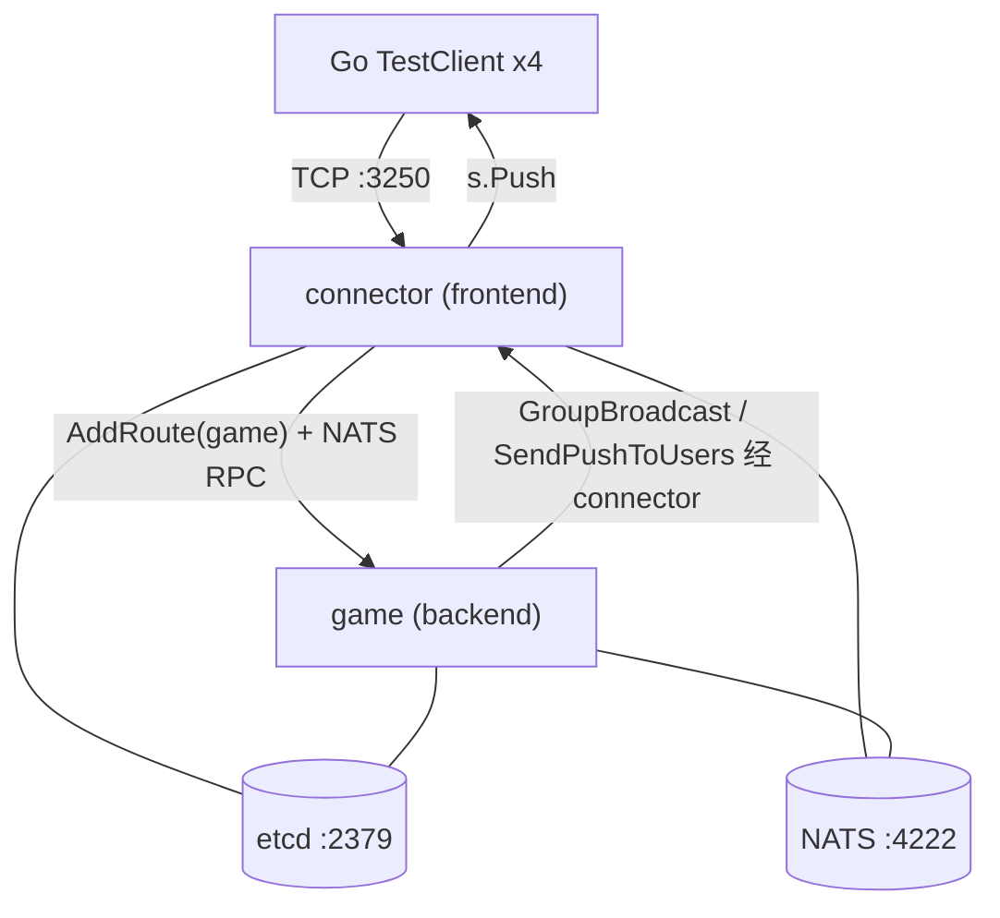
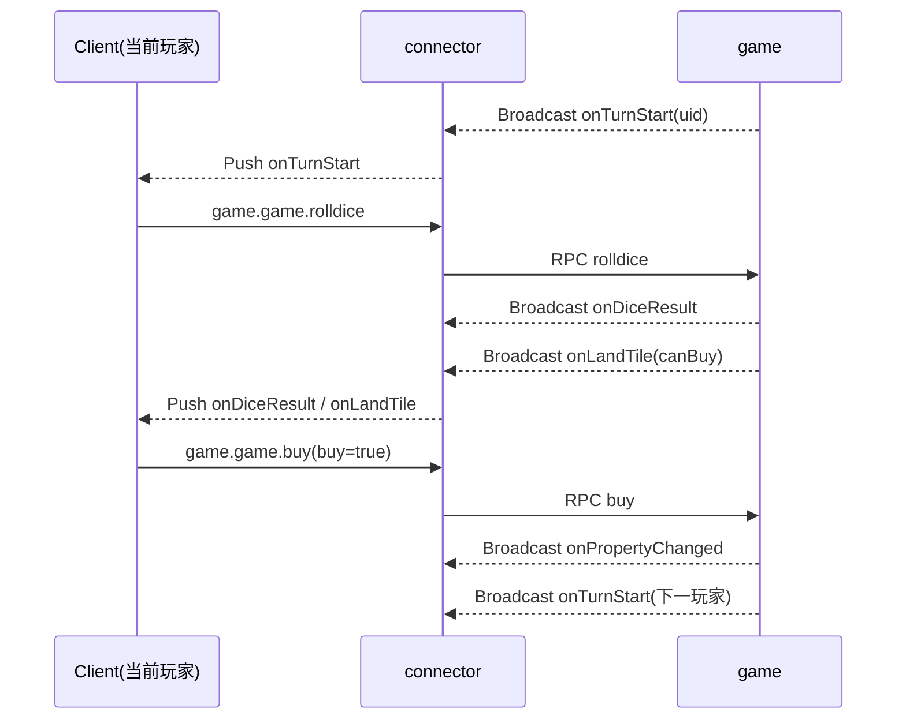

# 大富翁10 房间对战游戏 - 策划案 / 需求文档

> 基于 Pitaya 集群模式（工作区内为 `pitaya/v3`）实现的 4 人房间对战大富翁游戏。
> 采用 connector(前端) / game(后端) 分离架构，全链路 protobuf 序列化，etcd + NATS 集群。

---

## 1. 产品概述

### 1.1 一句话描述
4 名玩家在同一房间内轮流掷骰、绕环形地图移动、买地收租，通过经营地产使对手破产或在回合上限时资产最多者获胜。

### 1.2 目标与范围（MVP）
- 验证 Pitaya 集群下「前后端分离 + protobuf 协议 + 房间对战」的完整闭环。
- 单局：4 人固定开局，环形地图，回合制。
- 提供 Go 自动化测试客户端，无人工干预跑通整局。

### 1.3 非目标（本期不做，列为后续扩展）
- 银行/股票、监狱、道具卡（拆迁/免过路费）、随机事件系统。
- 多张地图、多 game 后端实例房间分片、断线重连、持久化存档、匹配排队。

---

## 2. 核心玩法规则

### 2.1 玩家与资源
| 项 | 值 |
| --- | --- |
| 房间人数 | 固定 4 人开局 |
| 初始现金 | 10000 |
| 经过/停留起点工资 | 2000 |
| 回合上限 | 50 回合（超过按资产排名结算） |
| 回合操作超时 | 15 秒（超时自动执行默认操作） |

### 2.2 地图（固定环形，20 格）
索引 0~19，玩家从 0 号（起点）出发顺时针移动，走满一圈回到 0 视为「经过起点」发工资。

| 索引 | 类型 | 名称 | 参数 |
| --- | --- | --- | --- |
| 0 | START | 起点 | 经过/停留发工资 2000 |
| 1 | PROPERTY | 城中村 | 价 1000 / 基础过路费 100 |
| 2 | CHANCE | 机会 | 抽机会卡 |
| 3 | PROPERTY | 老街 | 价 1200 / 过路费 120 |
| 4 | PROPERTY | 市场 | 价 1400 / 过路费 140 |
| 5 | TAX | 税务局 | 缴税 500 |
| 6 | PROPERTY | 车站 | 价 1600 / 过路费 160 |
| 7 | FATE | 命运 | 抽命运卡 |
| 8 | PROPERTY | 商业街 | 价 1800 / 过路费 180 |
| 9 | PROPERTY | 公园 | 价 2000 / 过路费 200 |
| 10 | START | 中转（视为普通停留，不发工资） | — |
| 11 | PROPERTY | 学区房 | 价 2200 / 过路费 220 |
| 12 | CHANCE | 机会 | 抽机会卡 |
| 13 | PROPERTY | 写字楼 | 价 2400 / 过路费 240 |
| 14 | PROPERTY | 酒店 | 价 2600 / 过路费 260 |
| 15 | TAX | 税务局 | 缴税 800 |
| 16 | PROPERTY | 商场 | 价 2800 / 过路费 280 |
| 17 | FATE | 命运 | 抽命运卡 |
| 18 | PROPERTY | CBD | 价 3000 / 过路费 300 |
| 19 | PROPERTY | 地标大厦 | 价 3500 / 过路费 350 |

> 说明：索引 10 为普通停留格（占位，避免 START 逻辑重复触发），仅 0 号为发工资起点。

### 2.3 地产与过路费
- 地产等级：0（空地未开发，买下后为 1 级）→ 最高 3 级。
- 升级费用 = 基础价 × 0.5（每级）。
- 过路费 = 基础过路费 × 等级系数：1 级 ×1、2 级 ×2、3 级 ×4。
- 地产估值（用于结算/破产清算）= 基础价 + 已投入升级费。

### 2.4 回合流程
1. 服务端广播 `OnTurnStart`（当前行动玩家）。
2. 当前玩家发 `RollDiceRequest`（超时则自动掷骰）。
3. 服务端掷骰 1~6，计算新位置，若经过 0 号发工资，广播 `OnDiceResult`。
4. 结算落地格 `OnLandTile`，并给出可选操作：
   - 空地产 → `canBuy=true`，玩家 `BuyRequest{buy}` 决定是否购买（超时=放弃）。
   - 自己地产且未满级 → `canUpgrade=true`，玩家 `UpgradeRequest{upgrade}`（超时=放弃）。
   - 他人地产 → 强制付过路费，广播 `OnPayToll`。
   - 机会/命运 → 抽卡执行，广播 `OnCardDrawn`。
   - 税收 → 扣税。
5. 结算完成后进入下家（`EndTurnRequest` 或服务端自动切换）。

### 2.5 机会/命运卡（MVP 简化）
- 机会（CHANCE）：随机其一
  - 幸运奖金 +1000
  - 违章罚款 -800
  - 传送到起点（并发工资）
- 命运（FATE）：随机其一
  - 天降横财 +1500
  - 医疗支出 -1000
  - 全体分红：其余玩家各给你 200

### 2.6 破产与结算
- 当玩家需支付（过路费/税/罚款）但现金不足：
  - MVP：直接破产（不做抵押）。名下地产收归「无主」（重置为可购买空地），玩家标记 `bankrupt`，退出行动轮转，广播 `OnPlayerBankrupt`。
- 结束条件（满足其一）：
  - 仅剩 1 名未破产玩家 → 该玩家胜。
  - 达到回合上限 50 → 按总资产（现金 + 地产估值）降序排名，最高者胜。
- 广播 `OnGameEnd`（排名列表 + 胜者 uid）。

---

## 3. 系统架构



- **connector（frontend）**：TCP 接入、`connector.login` 登录、`s.Bind(uid)` 绑定会话、`AddRoute("game")` 转发。
- **game（backend）**：房间管理、游戏状态机、`GroupCreate(roomId)` + `GroupBroadcast` 房间广播、`SendPushToUsers` 私有推送（如各自手牌/资产）。
- **序列化**：前后端 `builder.Serializer = protobuf.NewSerializer()`，所有消息为 `proto.Message`。
- **集群**：服务发现 etcd，RPC 传输 NATS（默认 Builder 自动装配）。

---

## 4. 通信协议（protobuf）

路由约定：`{svType}.{component}.{method}`，方法名小写。

协议在 [protos/richman.proto](protos/richman.proto) 中用 `service` 正式描述客户端可调用接口（`ConnectorService` / `GameService`），并用枚举替代裸整型：`ResultCode`、`TileType`、`CardType`、`RoomState`、`EndReason`、`PropertyAction`。注：Pitaya 的 handler 路由在 Go 代码里注册，proto 的 `service` 仅作接口契约文档；用 `protoc --go_out` 生成时不产生 gRPC 桩，不影响运行。

### 4.1 请求（Request，client → server）
| 路由 | 请求 | 响应 | 说明 |
| --- | --- | --- | --- |
| `connector.login` | `LoginRequest{playerName}` | `LoginResponse{code,uid,msg}` | 登录并绑定会话 |
| `game.game.join` | `JoinRoomRequest{}` | `JoinRoomResponse{code,roomId,seat}` | 进入/创建房间 |
| `game.game.rolldice` | `RollDiceRequest{}` | `AckResponse{code,msg}` | 掷骰 |
| `game.game.buy` | `BuyRequest{buy}` | `AckResponse{code,msg}` | 购买当前地产 |
| `game.game.upgrade` | `UpgradeRequest{upgrade}` | `AckResponse{code,msg}` | 升级当前地产 |
| `game.game.endturn` | `EndTurnRequest{}` | `AckResponse{code,msg}` | 主动结束回合 |
| `game.game.getroominfo` | `RoomInfoRequest{}` | `RoomInfoResponse{...}` | 查询房间快照（状态同步/重连） |

`code` 均为 `ResultCode` 枚举：`RESULT_OK/ERROR/NOT_LOGIN/NOT_IN_ROOM/BAD_TURN`。

### 4.2 推送（Push，server → client）
| 路由 | 消息 | 触发时机 |
| --- | --- | --- |
| `onRoomUpdate` | `RoomUpdatePush{players[],need}` | 有人进房/房间状态变化 |
| `onGameStart` | `GameStartPush{tiles[],players[],order[],initMoney,maxRound}` | 满 4 人开局 |
| `onTurnStart` | `TurnStartPush{uid,seat,round}` | 轮到某玩家 |
| `onDiceResult` | `DiceResultPush{uid,dice,fromPos,toPos,passStart,salary}` | 掷骰移动 |
| `onLandTile` | `LandTilePush{uid,pos,tileType,canBuy,canUpgrade,price,money,level,ownerUid}` | 落地结算 |
| `onPropertyChanged` | `PropertyChangedPush{uid,pos,ownerUid,level,action,money}` | 买地/升级 |
| `onPayToll` | `PayTollPush{fromUid,toUid,amount,pos,fromMoney,toMoney,isTax}` | 支付过路费/税 |
| `onCardDrawn` | `CardDrawnPush{uid,cardType,desc,moneyDelta,moveTo,money}` | 抽机会/命运 |
| `onPlayerBankrupt` | `PlayerBankruptPush{uid,seat}` | 玩家破产 |
| `onGameEnd` | `GameEndPush{rankings[],winnerUid,winnerName,reason}` | 对局结束 |
| `onError` | `ErrorPush{code,msg}` | 非法操作/错误 |

### 4.3 公共结构与枚举（片段）
```proto
enum ResultCode { RESULT_OK = 0; RESULT_ERROR = 1; RESULT_NOT_LOGIN = 2; RESULT_NOT_IN_ROOM = 3; RESULT_BAD_TURN = 4; }
enum TileType { TILE_START = 0; TILE_PROPERTY = 1; TILE_CHANCE = 2; TILE_FATE = 3; TILE_TAX = 4; TILE_STOP = 5; }
enum CardType { CARD_CHANCE = 0; CARD_FATE = 1; }
enum RoomState { ROOM_WAITING = 0; ROOM_PLAYING = 1; ROOM_SETTLEMENT = 2; }
enum EndReason { END_UNKNOWN = 0; END_LAST_STANDING = 1; END_ROUND_LIMIT = 2; }
enum PropertyAction { PROP_BUY = 0; PROP_UPGRADE = 1; }

message PlayerInfo {
  string uid = 1; string name = 2; int32 seat = 3;
  int64 money = 4; int32 pos = 5; bool bankrupt = 6; bool is_ai = 7;
}

message TileInfo {
  int32 index = 1; TileType type = 2; string name = 3;
  int64 price = 4; int64 base_toll = 5;
  string owner_uid = 6; int32 level = 7; int64 tax = 8;
}

message RankItem {
  string uid = 1; string name = 2;
  int64 total_asset = 3; int32 rank = 4; bool bankrupt = 5;
}
```

### 4.4 服务接口定义（proto service）
```proto
service ConnectorService {           // 客户端直连前端
  rpc Login(LoginRequest) returns (LoginResponse);        // connector.login
}

service GameService {                // 客户端经 connector 转发(game.game.*)
  rpc Join(JoinRoomRequest) returns (JoinRoomResponse);   // game.game.join
  rpc RollDice(RollDiceRequest) returns (AckResponse);    // game.game.rolldice
  rpc Buy(BuyRequest) returns (AckResponse);              // game.game.buy
  rpc Upgrade(UpgradeRequest) returns (AckResponse);      // game.game.upgrade
  rpc EndTurn(EndTurnRequest) returns (AckResponse);      // game.game.endturn
  rpc GetRoomInfo(RoomInfoRequest) returns (RoomInfoResponse); // game.game.getroominfo
}
```

---

## 5. 关键时序（一次完整回合）



---

## 6. 目录结构（交付物）

```
examples/demo/richman/
├── REQUIREMENTS.md          # 本文档
├── docker-compose.yml       # etcd + nats
├── main.go                  # 支持 -type/-frontend/-port，集群 Builder + protobuf serializer
├── protos/
│   ├── richman.proto        # 协议定义
│   └── richman.pb.go        # 生成/手写的 pb 代码
├── services/
│   ├── connector.go         # frontend：login + 会话绑定
│   └── game.go              # backend：房间 handler + RoomManager + 推送
├── game/
│   ├── map.go               # 20 格环形地图
│   ├── tile.go              # 格子类型与地产逻辑
│   ├── player.go            # 玩家资产/位置/破产状态
│   ├── dice.go              # 掷骰
│   ├── card.go              # 机会/命运卡
│   ├── manager.go           # 房间管理器(匹配/查找)
│   └── room.go              # 房间状态机 + 回合轮转 + 结算 + 超时
├── testclient/
│   └── main.go              # 4 玩家自动化对局客户端
└── localinfra/
    └── main.go              # (可选)无 docker 时启动本地 etcd+nats
```

---

## 7. 运行方式

```bash
cd examples/demo/richman
docker compose up -d                       # etcd + nats
go run main.go -type game -frontend=false -port 3251   # 后端
go run main.go -type connector -frontend=true -port 3250   # 前端
go run testclient/main.go                  # 4 玩家自动对局
```

也可用 Makefile 目标(在仓库根目录)：

```bash
make run-richman-example-game        # 后端
make run-richman-example-connector   # 前端
make run-richman-example-testclient  # 测试客户端
```

无 Docker 环境时, 可用内置的本地基础设施启动器(基于 pitaya 已内置的 nats-server 与嵌入式 etcd, 监听 :4222 / :2379)：

```bash
go run ./examples/demo/richman/localinfra   # 替代 docker compose, 前台运行
```

---

## 8. 风险与注意点
- 启用 protobuf serializer 后，**所有** handler 参数/返回值（含 login）必须是 `proto.Message`，不能沿用斗地主示例的 JSON struct。
- 生成 `richman.pb.go` 需本地 `protoc` + `protoc-gen-go`；若缺失则手写等价 pb 代码兜底。
- MVP 为单 game 后端实例 + `MemoryGroupService`；多实例房间分片需换 `EtcdGroupService` + 按 roomId 路由（后续扩展）。
- 回合超时依赖服务端定时器，需在房间销毁时正确停止 timer，避免 goroutine 泄漏。
