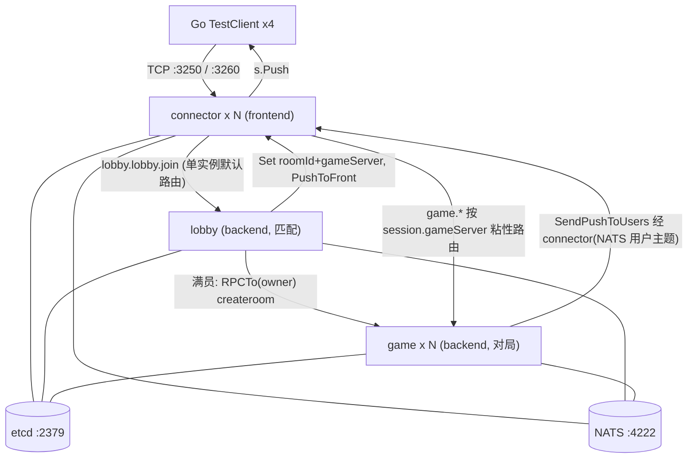
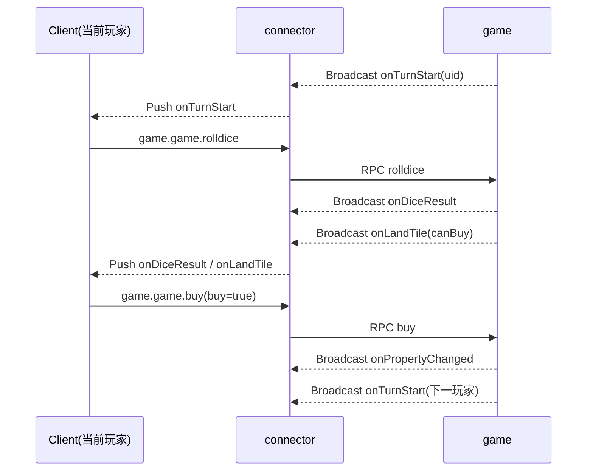

# 大富翁10 房间对战游戏 - 策划案 / 需求文档

> 基于 **Pitaya v2**（`github.com/topfreegames/pitaya/v2`）集群模式实现的 4 人房间对战大富翁游戏。
> 采用 connector(前端) / game(后端) 分离架构，全链路 protobuf 序列化，etcd + NATS 集群。
>
> **模块说明**：本示例位于 pitaya v3 仓库目录树内，但为一个**独立 Go 模块**（`module richman`，见本目录 `go.mod`），依赖 `pitaya/v2`。因 v2 要求 `go >= 1.25` 而外层仓库 `go.work` 固定较低工具链，构建/运行本示例时须在本目录内并设置 `GOWORK=off`（脱离外层 workspace，使用本模块自带 go.mod 与工具链）。

---

## 1. 产品概述

### 1.1 一句话描述
4 名玩家在同一房间内轮流掷骰、绕环形地图移动、买地收租，通过经营地产使对手破产或在回合上限时资产最多者获胜。

### 1.2 目标与范围（MVP）
- 验证 Pitaya 集群下「前后端分离 + protobuf 协议 + 房间对战」的完整闭环。
- 单局：4 人固定开局，环形地图，回合制。
- 提供 Go 自动化测试客户端，无人工干预跑通整局。

### 1.3 非目标（本期不做，列为后续扩展）
- 银行/股票、监狱、道具卡（拆迁/免过路费）、随机事件系统。
- 多张地图、多 game 后端实例房间分片、断线重连、持久化存档、匹配排队。

---

## 2. 核心玩法规则

### 2.1 玩家与资源
| 项 | 值 |
| --- | --- |
| 房间人数 | 固定 4 人开局 |
| 初始现金 | 10000 |
| 经过/停留起点工资 | 2000 |
| 回合上限 | 50 回合（超过按资产排名结算） |
| 回合操作超时 | 15 秒（超时自动执行默认操作） |

### 2.2 地图（固定环形，20 格）
索引 0~19，玩家从 0 号（起点）出发顺时针移动，走满一圈回到 0 视为「经过起点」发工资。

| 索引 | 类型 | 名称 | 参数 |
| --- | --- | --- | --- |
| 0 | START | 起点 | 经过/停留发工资 2000 |
| 1 | PROPERTY | 城中村 | 价 1000 / 基础过路费 100 |
| 2 | CHANCE | 机会 | 抽机会卡 |
| 3 | PROPERTY | 老街 | 价 1200 / 过路费 120 |
| 4 | PROPERTY | 市场 | 价 1400 / 过路费 140 |
| 5 | TAX | 税务局 | 缴税 500 |
| 6 | PROPERTY | 车站 | 价 1600 / 过路费 160 |
| 7 | FATE | 命运 | 抽命运卡 |
| 8 | PROPERTY | 商业街 | 价 1800 / 过路费 180 |
| 9 | PROPERTY | 公园 | 价 2000 / 过路费 200 |
| 10 | START | 中转（视为普通停留，不发工资） | — |
| 11 | PROPERTY | 学区房 | 价 2200 / 过路费 220 |
| 12 | CHANCE | 机会 | 抽机会卡 |
| 13 | PROPERTY | 写字楼 | 价 2400 / 过路费 240 |
| 14 | PROPERTY | 酒店 | 价 2600 / 过路费 260 |
| 15 | TAX | 税务局 | 缴税 800 |
| 16 | PROPERTY | 商场 | 价 2800 / 过路费 280 |
| 17 | FATE | 命运 | 抽命运卡 |
| 18 | PROPERTY | CBD | 价 3000 / 过路费 300 |
| 19 | PROPERTY | 地标大厦 | 价 3500 / 过路费 350 |

> 说明：索引 10 为普通停留格（占位，避免 START 逻辑重复触发），仅 0 号为发工资起点。

### 2.3 地产与过路费
- 地产等级：0（空地未开发，买下后为 1 级）→ 最高 3 级。
- 升级费用 = 基础价 × 0.5（每级）。
- 过路费 = 基础过路费 × 等级系数：1 级 ×1、2 级 ×2、3 级 ×4。
- 地产估值（用于结算/破产清算）= 基础价 + 已投入升级费。

### 2.4 回合流程
1. 服务端广播 `OnTurnStart`（当前行动玩家）。
2. 当前玩家发 `RollDiceRequest`（超时则自动掷骰）。
3. 服务端掷骰 1~6，计算新位置，若经过 0 号发工资，广播 `OnDiceResult`。
4. 结算落地格 `OnLandTile`，并给出可选操作：
   - 空地产 → `canBuy=true`，玩家 `BuyRequest{buy}` 决定是否购买（超时=放弃）。
   - 自己地产且未满级 → `canUpgrade=true`，玩家 `UpgradeRequest{upgrade}`（超时=放弃）。
   - 他人地产 → 强制付过路费，广播 `OnPayToll`。
   - 机会/命运 → 抽卡执行，广播 `OnCardDrawn`。
   - 税收 → 扣税。
5. 结算完成后进入下家（`EndTurnRequest` 或服务端自动切换）。

### 2.5 机会/命运卡（MVP 简化）
- 机会（CHANCE）：随机其一
  - 幸运奖金 +1000
  - 违章罚款 -800
  - 传送到起点（并发工资）
- 命运（FATE）：随机其一
  - 天降横财 +1500
  - 医疗支出 -1000
  - 全体分红：其余玩家各给你 200

### 2.6 破产与结算
- 当玩家需支付（过路费/税/罚款）但现金不足：
  - MVP：直接破产（不做抵押）。名下地产收归「无主」（重置为可购买空地），玩家标记 `bankrupt`，退出行动轮转，广播 `OnPlayerBankrupt`。
- 结束条件（满足其一）：
  - 仅剩 1 名未破产玩家 → 该玩家胜。
  - 达到回合上限 50 → 按总资产（现金 + 地产估值）降序排名，最高者胜。
- 广播 `OnGameEnd`（排名列表 + 胜者 uid）。

---

## 3. 系统架构

多节点集群：`connector`(N，接入) + `lobby`(1，全局匹配) + `game`(N，对局)。房间按 `roomId` 用 rendezvous 哈希在建房时选定 owner game 节点，owner 写入 session，`game.*` 请求按 session 粘性路由到 owner。



- **connector（frontend, N 台）**：TCP 接入、`connector.login` 登录 `s.Bind(uid)`；`AddRoute("game")` 粘性路由——直接读 `session.gameServer` 取对应 game 节点（不在路由时现算哈希，避免多 connector 视图不一致）。
- **lobby（backend）**：全局匹配，分配 `roomId` + 座位；建房时用 `routing.OwnerServerID`（rendezvous 哈希）选定 owner game 节点；把 `roomId`/`gameServer` 写入玩家 session 并 `PushToFront`；满员后经内部 RPC `game.gameremote.createroom` 通知 owner 建房开局；等待期推送 `onRoomUpdate`。**扩容**：启用 Redis 时匹配走共享队列(Lua 原子撮合)，lobby 无本地状态、可水平多副本；`-redis` 为空时退化为单实例内存匹配。
- **game（backend, N 台）**：仅持有本节点 owner 的房间（`RoomManager` 内存态）、游戏状态机；开局后的所有推送经 `SendPushToUsers` 按 uid 回推（跨 connector 由 NATS 用户主题保证）。
- **房间放置 vs 查找**：哈希只用于建房时“选一次”owner；查找一律读 session 存的 owner。owner 随 session 固定，节点增减不影响已有房间路由。
- **序列化**：三类型均 `builder.Serializer = protobuf.NewSerializer()`，所有消息为 `proto.Message`。
- **集群**：服务发现 etcd，RPC 传输 NATS（默认 Builder 自动装配）；uid→connector 推送靠 NATS 用户主题，无需 BindingStorage。

---

## 4. 通信协议（protobuf）

路由约定：`{svType}.{component}.{method}`，方法名小写。

协议在 [protos/richman.proto](protos/richman.proto) 中用 `service` 正式描述客户端可调用接口（`ConnectorService` / `LobbyService` / `GameService`），并用枚举替代裸整型：`ResultCode`、`TileType`、`CardType`、`RoomState`、`EndReason`、`PropertyAction`。注：Pitaya 的 handler 路由在 Go 代码里注册，proto 的 `service` 仅作接口契约文档；用 `protoc --go_out` 生成时不产生 gRPC 桩，不影响运行。

服务器间内部 RPC（非客户端可见）：`game.gameremote.createroom`，参数 `CreateRoomRequest{roomId, members[]}`，由 lobby 满员后调用 owner game 节点建房。

**前置约定**：`game.*` 按 `session.gameServer` 粘性路由，客户端必须在收到 `lobby.join` 响应（或后续 `onGameStart` 推送）之后再发起 `game.*`；此前 session 无 gameServer，路由会拒绝。断线重连会得到无 gameServer 的新 session，Phase 1 不支持恢复（见后续 Redis 抗宕机增强）。

### 4.1 请求（Request，client → server）
| 路由 | 请求 | 响应 | 说明 |
| --- | --- | --- | --- |
| `connector.login` | `LoginRequest{playerName}` | `LoginResponse{code,uid,msg}` | 登录并绑定会话 |
| `lobby.lobby.join` | `JoinRoomRequest{playerName}` | `JoinRoomResponse{code,roomId,seat}` | 匹配进房(经 lobby，写入 session.gameServer) |
| `game.game.rolldice` | `RollDiceRequest{}` | `AckResponse{code,msg}` | 掷骰 |
| `game.game.buy` | `BuyRequest{buy}` | `AckResponse{code,msg}` | 购买当前地产 |
| `game.game.upgrade` | `UpgradeRequest{upgrade}` | `AckResponse{code,msg}` | 升级当前地产 |
| `game.game.endturn` | `EndTurnRequest{}` | `AckResponse{code,msg}` | 主动结束回合 |
| `game.game.getroominfo` | `RoomInfoRequest{}` | `RoomInfoResponse{...}` | 查询房间快照（状态同步/重连） |

`code` 均为 `ResultCode` 枚举：`RESULT_OK/ERROR/NOT_LOGIN/NOT_IN_ROOM/BAD_TURN`。

### 4.2 推送（Push，server → client）
| 路由 | 消息 | 触发时机 |
| --- | --- | --- |
| `onRoomUpdate` | `RoomUpdatePush{players[],need}` | 有人进房/房间状态变化 |
| `onGameStart` | `GameStartPush{tiles[],players[],order[],initMoney,maxRound}` | 满 4 人开局 |
| `onTurnStart` | `TurnStartPush{uid,seat,round}` | 轮到某玩家 |
| `onDiceResult` | `DiceResultPush{uid,dice,fromPos,toPos,passStart,salary}` | 掷骰移动 |
| `onLandTile` | `LandTilePush{uid,pos,tileType,canBuy,canUpgrade,price,money,level,ownerUid}` | 落地结算 |
| `onPropertyChanged` | `PropertyChangedPush{uid,pos,ownerUid,level,action,money}` | 买地/升级 |
| `onPayToll` | `PayTollPush{fromUid,toUid,amount,pos,fromMoney,toMoney,isTax}` | 支付过路费/税 |
| `onCardDrawn` | `CardDrawnPush{uid,cardType,desc,moneyDelta,moveTo,money}` | 抽机会/命运 |
| `onPlayerBankrupt` | `PlayerBankruptPush{uid,seat}` | 玩家破产 |
| `onGameEnd` | `GameEndPush{rankings[],winnerUid,winnerName,reason}` | 对局结束 |
| `onError` | `ErrorPush{code,msg}` | 非法操作/错误 |

### 4.3 公共结构与枚举（片段）
```proto
enum ResultCode { RESULT_OK = 0; RESULT_ERROR = 1; RESULT_NOT_LOGIN = 2; RESULT_NOT_IN_ROOM = 3; RESULT_BAD_TURN = 4; }
enum TileType { TILE_START = 0; TILE_PROPERTY = 1; TILE_CHANCE = 2; TILE_FATE = 3; TILE_TAX = 4; TILE_STOP = 5; }
enum CardType { CARD_CHANCE = 0; CARD_FATE = 1; }
enum RoomState { ROOM_WAITING = 0; ROOM_PLAYING = 1; ROOM_SETTLEMENT = 2; }
enum EndReason { END_UNKNOWN = 0; END_LAST_STANDING = 1; END_ROUND_LIMIT = 2; }
enum PropertyAction { PROP_BUY = 0; PROP_UPGRADE = 1; }

message PlayerInfo {
  string uid = 1; string name = 2; int32 seat = 3;
  int64 money = 4; int32 pos = 5; bool bankrupt = 6; bool is_ai = 7;
}

message TileInfo {
  int32 index = 1; TileType type = 2; string name = 3;
  int64 price = 4; int64 base_toll = 5;
  string owner_uid = 6; int32 level = 7; int64 tax = 8;
}

message RankItem {
  string uid = 1; string name = 2;
  int64 total_asset = 3; int32 rank = 4; bool bankrupt = 5;
}
```

### 4.4 服务接口定义（proto service）
```proto
service ConnectorService {           // 客户端直连前端
  rpc Login(LoginRequest) returns (LoginResponse);        // connector.login
}

service GameService {                // 客户端经 connector 转发(game.game.*)
  rpc Join(JoinRoomRequest) returns (JoinRoomResponse);   // game.game.join
  rpc RollDice(RollDiceRequest) returns (AckResponse);    // game.game.rolldice
  rpc Buy(BuyRequest) returns (AckResponse);              // game.game.buy
  rpc Upgrade(UpgradeRequest) returns (AckResponse);      // game.game.upgrade
  rpc EndTurn(EndTurnRequest) returns (AckResponse);      // game.game.endturn
  rpc GetRoomInfo(RoomInfoRequest) returns (RoomInfoResponse); // game.game.getroominfo
}
```

---

## 5. 关键时序（一次完整回合）



---

## 6. 目录结构（交付物）

```
examples/demo/richman/
├── REQUIREMENTS.md          # 本文档
├── docker-compose.yml       # etcd + nats
├── main.go                  # 支持 -type(connector/lobby/game)/-frontend/-port；connector 装配粘性路由
├── protos/
│   ├── richman.proto        # 协议定义(含 LobbyService 与内部 CreateRoomRequest)
│   └── richman.pb.go        # 生成的 pb 代码
├── routing/
│   └── owner.go             # rendezvous 哈希: roomId -> owner game 节点(仅建房/重指派时选)
├── store/
│   └── redis.go             # Redis 目录 + 快照 + 恢复锁 + 共享匹配队列(Lua 原子撮合)
├── services/
│   ├── connector.go         # frontend：login + 会话绑定
│   ├── lobby.go             # backend(单实例)：全局匹配 + 分配 owner + 建房 + ResolveOwner 恢复
│   └── game.go              # backend：对局 handler + GameRemote(CreateRoom/RestoreRoom) + 推送 + 快照
├── game/
│   ├── map.go               # 20 格环形地图
│   ├── tile.go              # 格子类型与地产逻辑
│   ├── player.go            # 玩家资产/位置/破产状态
│   ├── dice.go              # 掷骰
│   ├── card.go              # 机会/命运卡
│   ├── manager.go           # 房间管理器(按 roomId 建房/恢复/查找, 本节点内存)
│   ├── snapshot.go          # (Phase 2)房间快照 ToSnapshot/RestoreRoom/Resume
│   └── room.go              # 房间状态机 + 回合轮转 + 结算 + 超时
├── testclient/
│   └── main.go              # 4 玩家自动化对局客户端
└── localinfra/
    └── main.go              # (可选)无 docker 时启动本地 etcd+nats
```

---

## 7. 运行方式

> 本示例为独立模块(依赖 pitaya/v2, 需 go>=1.25)。所有命令均在 `examples/demo/richman` 目录内、并带上 `GOWORK=off` 前缀执行。

```bash
cd examples/demo/richman
docker compose up -d                                             # etcd + nats
# 多节点集群: 1 lobby + 2 game + 2 connector(各自独立终端)
GOWORK=off go run . -type lobby     -frontend=false -port 3252   # 匹配(单实例)
GOWORK=off go run . -type game      -frontend=false -port 3251   # 对局节点1
GOWORK=off go run . -type game      -frontend=false -port 3253   # 对局节点2
GOWORK=off go run . -type connector -frontend=true  -port 3250   # 接入1
GOWORK=off go run . -type connector -frontend=true  -port 3260   # 接入2
GOWORK=off go run ./testclient                                   # 4 玩家(轮流连 3250/3260)
```

也可用 Makefile 目标(在仓库根目录, 已内置 `cd` 与 `GOWORK=off`)：

```bash
make run-richman-example-localinfra   # 本地 etcd+nats(无 Docker 时)
make run-richman-example-lobby        # 匹配(单实例)
make run-richman-example-game         # 对局节点1 (:3251)
make run-richman-example-game2        # 对局节点2 (:3253)
make run-richman-example-connector    # 接入1 (:3250)
make run-richman-example-connector2   # 接入2 (:3260)
make run-richman-example-testclient   # 测试客户端
```

无 Docker 环境时, 可用内置的本地基础设施启动器(基于 pitaya 已内置的 nats-server 与嵌入式 etcd, 监听 :4222 / :2379)：

```bash
cd examples/demo/richman
GOWORK=off go run ./localinfra   # 替代 docker compose, 前台运行
```

---

## 7.1 抗宕机：Redis 快照 + 惰性恢复（Phase 2）

在内存态 + 亲和模型之上叠加, 目标：owner 宕机时把损失从“整局丢失”降到“回退到上一个回合检查点”, 并自动重指派恢复。默认连接 `127.0.0.1:6379`（`-redis` 可改，置空则禁用、退化为 Phase 1）。

- **快照写入(低频)**：每个回合开始时(回合边界)异步写 `RoomSnapshot` 到 Redis；优雅关机(SIGTERM)时 `app.Start()` 返回后对本节点全部房间再 flush 一次。
- **目录**：`richman:room:{roomId}:owner` 记录 owner；lobby 建房与恢复时写入。
- **惰性恢复**：connector 路由发现 `session.gameServer` 不在存活节点中 → RPC `lobby.lobbyremote.resolveowner`；lobby 读目录，owner 仍存活则直接返回，否则 `SETNX` 抢恢复锁 → rendezvous 在存活节点重选 newOwner → `RPCTo(newOwner, game.gameremote.restoreroom)` 从 Redis 快照 `RestoreRoom` 并续跑 → 更新目录 → connector 本地改写 `session.gameServer` 并路由过去。恢复后 game 向房间玩家重推 `onGameStart` 以 resync。
- **RPO**：= 回合快照间隔；崩溃丢失“上次快照之后”的该回合操作(由 `onTurnStart` 续跑重做)。优雅关机因末尾 flush 近似无损。
- **键 TTL**：快照/目录 30 分钟, 恢复锁 10 秒(防并发双恢复)。
- **本地基础设施**：`localinfra` 内嵌 miniredis(:6379)；docker-compose 亦含 redis 服务。

## 8. 风险与注意点
- 启用 protobuf serializer 后，**所有** handler 参数/返回值（含 login）必须是 `proto.Message`，不能沿用斗地主示例的 JSON struct。
- 生成 `richman.pb.go` 需本地 `protoc` + `protoc-gen-go`。
- 房间状态为 game 节点内存态：owner 宕机则该房间丢失（Phase 2 用 Redis 快照 + 惰性恢复缓解）。
- lobby 启用 Redis 后可水平扩容(共享匹配队列 + Lua 原子撮合)；未启用 Redis 时为单实例内存匹配(SPOF)。同一时刻仅一个"开放房间"按序凑满 4 人。
- 回合超时依赖服务端定时器，需在房间销毁时正确停止 timer，避免 goroutine 泄漏。
- 推送按 uid 经 NATS 用户主题回推，天然支持多 connector；未使用 Group 广播，故无需 `EtcdGroupService`。
